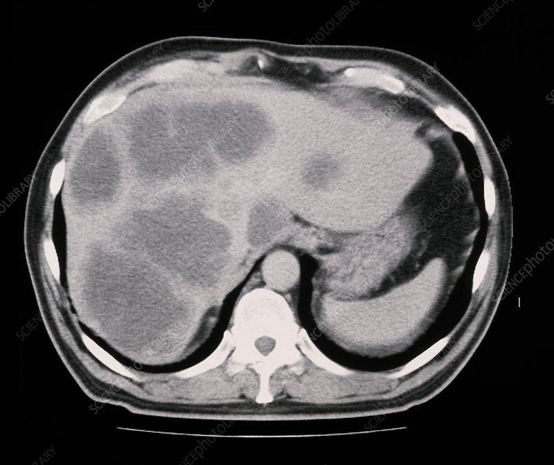
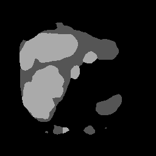

# Liver Tumor Segmentation
A computer vision pipeline for liver and tumor segmentation using the Medical Segmentation Decathlon dataset. This project uses a modern transformer-based architecture (SegFormer) with custom training pipelines, MLFlow experiment tracking, and Optuna hyperparameter tuning. Models are trained and evaluated with attention to class imbalance and tumor specificity. The final model is deployed via a GPU-enabled FastAPI server, containerized with Docker, and ready for real-world inference. Built for practical deployment and MLOps readiness. [Dataset link](https://decathlon-10.grand-challenge.org/). [Model GitHub](https://github.com/NVlabs/SegFormer).

## Final Metrics:
- Mean IoU on Test Set (averaged across images): 0.6208
- Per-Class IoU on Test Set:
    - Background IoU: 0.9900
    - Liver IoU: 0.8658
    - Tumor IoU: 0.2386


## Sample Input → Model Prediction:
<p float="left">
  
  
</p>

## Training

### Create and Activate Conda Environment
```bash
conda create -n med_img_seg python=3.10
conda activate med_img_seg
```

### Install Pipenv and Project Dependencies
```bash
conda install pipenv
pipenv --python $(which python)
pipenv install --dev
```

### Build Dev Container

```bash
docker build -t medimgseg-dev -f Dockerfile_dev .
```

### Run Dev Container:

```bash
docker run --gpus all -it --rm --shm-size=32g -p 8888:8888 -v $(pwd):/app medimgseg-dev
```

### Run Training:

```bash
pipenv run python scripts/tune_model.py
```

### Monitor MLFlow:

```bash
pipenv run mlflow ui
```

## Inference

### Build Inference Container:

```bash
docker build -f Dockerfile_inference -t medimgseg-inference .
```

### Run Inference Container (with GPU if available):
```bash
docker run --gpus all -it --rm --shm-size=32g -p 8000:8000 -v $(pwd):/app medimgseg-inference
```

### Test Inference API

```bash
pipenv run python scripts/test_api_client.py
```

## Next Steps:

    Dataset Expansion: Extend training to other abdominal organs with common tumors (kidney, pancreas) for better generalization.

    Advanced Data Augmentation: Add elastic deformations, random rotations, and intensity variations to improve robustness.

    Model Scaling: Use larger SegFormer backbones (e.g., B2, B4) for higher capacity models.

    Loss Function Improvement: Incorporate Dice Loss or Combo Loss to address small tumor segmentation better.

    Training Optimization: Add EarlyStopping callbacks to prevent overfitting and save resources.

    Model Registry: Integrate MLflow Model Registry for better versioning and promotion to production.

## Notes:

    Inference server accepts PNG/JPG images and returns segmentation masks.

    Training and inference both use GPU acceleration if available.

    All experiments tracked with MLflow for full reproducibility.